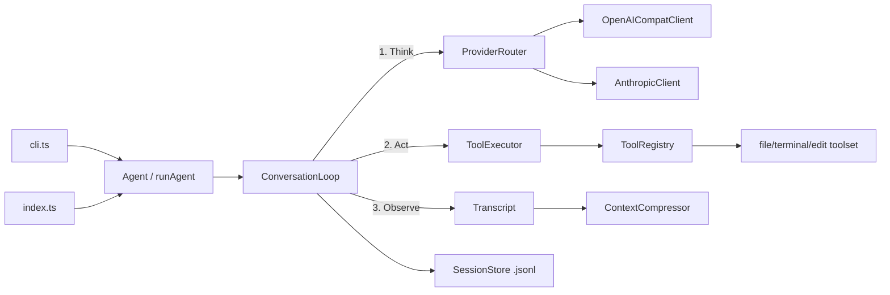

# Lich: TypeScript AI Agent Harness

## Architecture

Three layers, mirroring Hermes' design: **providers** (LLM access) → **agent** (Think-Act-Observe loop) → **tools** (capabilities), plus context management and session persistence.




## Project layout

```
lich/
├── package.json          # name: lich, type: module, bin: lich
├── tsconfig.json         # strict, NodeNext, ES2022
├── vitest.config.ts
├── src/
│   ├── index.ts          # public API: createAgent(), runAgent()
│   ├── cli.ts            # thin CLI: one-shot task + interactive chat
│   ├── agent/
│   │   ├── config.ts     # AgentConfig + zod validation
│   │   ├── events.ts     # typed emitter: turn_start, tool_call, token_usage...
│   │   └── loop.ts       # Think-Act-Observe loop, max_turns budget
│   ├── providers/
│   │   ├── types.ts      # LLMProvider interface, Message, ToolCall, ChatResult
│   │   ├── openai.ts     # one client, any OpenAI-compatible base URL
│   │   ├── anthropic.ts  # native Messages API (system + tool_use blocks)
│   │   ├── router.ts     # registry + provider resolution chain
│   │   └── failover.ts   # error classify (rate_limit/network/auth/overflow), backoff retry, fallback
│   ├── tools/
│   │   ├── types.ts      # Tool interface: name, description, jsonSchema, execute(ctx)
│   │   ├── registry.ts   # toolset registration, enable/disable
│   │   ├── executor.ts   # dispatch + guardrails + result stubs
│   │   └── builtin/      # read_file, write_file, edit_file, list_dir, terminal, grep_files
│   ├── context/
│   │   ├── tokens.ts     # rough chars/4 estimator (no heavy deps)
│   │   └── compressor.ts # summarize old turns into a stub when near budget
│   ├── session/
│   │   └── store.ts      # transcript persistence to .lich/sessions/*.jsonl
│   └── util/             # log, safe json parse (each helper ≤60 lines, no recursion)
└── test/
    ├── loop.test.ts      # loop w/ mock provider (final answer, tool call, budget stop)
    ├── failover.test.ts  # classification, retry, provider fallback
    ├── tools.test.ts     # builtin tools + executor guardrails
    └── compressor.test.ts
```

## Key design decisions

- **Provider interface**: `chat(messages, tools, opts) → { message, usage, finishReason }`. OpenAI client covers OpenAI/OpenRouter/DeepSeek/Nous Portal/local (configurable `baseUrl`); Anthropic client maps messages to its block format. Native `fetch`, zero SDK dependencies.
- **Loop**: Think (LLM call) → if `tool_calls`, Act (execute via registry) → Observe (append `tool` results) → repeat until final text or `maxTurns` reached. Streaming events emitted throughout so both CLI and library consumers can hook in.
- **Failover**: classify errors → transient ones retry with exponential backoff; then walk the provider chain (e.g. `["openrouter", "anthropic"]`).
- **Context compression**: when estimated tokens near the model budget, oldest turns are summarized via the same provider chain into a single context stub message.
- **Dependencies kept minimal**: `zod` (config/tool-schema validation), dev deps `typescript`, `tsx`, `tsup`, `vitest`. Everything else Node built-ins.

## Implementation order

1. Scaffold: `package.json`, `tsconfig`, vitest, src skeleton — verify `tsc` + tests run.
2. Provider layer: types → OpenAI-compatible client → Anthropic client → router + failover, tested against a mock fetch.
3. Tool layer: types/registry/executor + the six builtin tools with path-traversal and timeout guardrails.
4. Agent core: config, events, conversation loop with iteration budget, session store.
5. Context compressor + public API (`createAgent`/`runAgent`) + thin CLI.
6. End-to-end test with mock provider; smoke-run CLI against a real endpoint if the user has an API key in env.

## Conventions (per your rules)

snake_case naming, DRY, helpers ≤60 lines, no recursion, strict TypeScript (`===`, `const`).