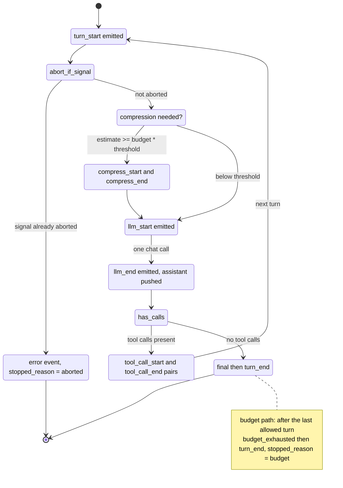

# The Agent Loop

`run_conversation` in [`src/agent/loop.ts`](../../src/agent/loop.ts) is the
heart of lich: a think-act-observe loop that drives a chat model, executes the
tools it requests, feeds results back, and compresses history when the context
budget demands it. It depends only on two narrow structural interfaces -
`ChatFn` and `ToolRunner` - never on the provider router or the tool executor
directly (see [overview](./overview.md#the-dependency-inversion-story)).

## State machine of one turn



## The `run_conversation` contract

```ts
export interface LoopOutcome {
  messages: Message[];
  final: AssistantMessage | undefined;
  result: ChatResult | undefined;
  turns_used: number;
  stopped_reason: "final" | "budget" | "aborted";
}
```

(src/agent/loop.ts)

**Parameters** (`LoopParams`): `system_prompt?`, `max_turns` (required),
`temperature?`, `max_tokens?`, `context_budget_tokens?`,
`compress_threshold?`, `signal?`.

**`max_turns` is an LLM-call budget, not a tool budget.** Each iteration makes
exactly one LLM call; the tool executions between turns are free - a turn that
calls three tools still consumes one turn. A model that always asks for tools
will run out of budget even though the tools all succeeded.

**Stopping conditions**, exactly as implemented:

| `stopped_reason` | When it fires |
| --- | --- |
| `"final"` | A turn's assistant message has an empty `tool_calls` array (or none). The message is emitted as `final` and the loop returns immediately, even if it is turn 1. |
| `"aborted"` | The abort check at the **top** of a turn sees `signal.aborted` before any LLM call. The loop emits an `error` event carrying `new DOMException("agent loop aborted", "AbortError")` and returns with `result: undefined`. |
| `"budget"` | The `for` loop over `1..max_turns` completes while every turn kept requesting tools. After the last allowed turn, `budget_exhausted` then `turn_end` are emitted. |

Note the asymmetry: abort is checked only at the loop top, so a signal that
fires mid-turn still lets the current LLM call and tool batch finish before
the next turn notices. Provider-level aborts can surface earlier as thrown
errors (see [Error propagation](#error-propagation) below).

`turns_used` counts LLM calls actually made: `turn` on the final path,
`turn - 1` on abort (the turn that was about to start never ran), and
`max_turns` on the budget path.

## Event stream

All events flow through `AgentEmitter` (`src/agent/events.ts`), a typed
emitter over a discriminated `AgentEvent` union. Handler errors are logged and
swallowed; handlers may unsubscribe mid-emit (the emitter iterates a snapshot).

| Event | Payload | Emitted when | Order guarantee |
| --- | --- | --- | --- |
| `turn_start` | `{ turn }` | Start of each iteration | First event of a turn |
| `compress_start` | `{ estimated_tokens }` | Compression begins | After `turn_start`, before `llm_start` |
| `compress_end` | `{ summary_chars }` | Compression rewrote history | Always paired after `compress_start` |
| `llm_start` | `{ turn }` | Just before the chat call | Exactly one per LLM call |
| `llm_end` | `{ turn, result }` | Chat call resolved | Pairs with `llm_start`; never fires if the call throws |
| `tool_call_start` | `{ turn, call }` | Before each tool executes | After `llm_end`, sequential per call |
| `tool_call_end` | `{ turn, call, result, cancelled? }` | After that tool resolves, or when abort skips a pending call | Normally pairs with `tool_call_start`; cancelled skips emit `cancelled: true` with no start |
| `final` | `{ message, result }` | A turn produced no tool calls | At most once per run; only on a real final |
| `budget_exhausted` | `{ turns_used }` | Loop exits without a final | Follows the last `tool_call_end` |
| `turn_end` | `{ turn }` | Last event of a turn | After `final` **or** after `budget_exhausted` |
| `error` | `{ error }` | Chat call failed (logged, rethrown) or loop aborted | Followed by no other events |

Verified ordering from `test/loop.test.ts` scenario A:

```text
turn_start, llm_start, llm_end, tool_call_start, tool_call_end,
turn_start, llm_start, llm_end, final, turn_end
```

## History semantics

`run_conversation` never mutates the caller's array. `seed_system_prompt`
copies it (`[...messages]`) and then applies the system prompt rules:

1. **No system message in history** - prepend `{ role: "system", content }`.
2. **A system message with identical content** - return the copy unchanged.
3. **A system message with different content** - replace it in place.

During the run, the history array *is* mutated in place (`push` for assistant
and tool messages, refill for compression) - the loop treats it as its own
working copy. Compression rewrites it via `history.length = 0` followed by a
refill from the compressed outcome, so callers holding the returned `messages`
array see the final, post-compression transcript.

### Compression gating

Compression is skipped when any of these hold:

- `context_budget_tokens` is undefined (the loop calls `compress_if_needed`,
  which returns immediately).
- `should_compress` is false: `estimate_messages_tokens(history) <
  budget * threshold` (threshold defaults to 0.8).
- The history has **8 or fewer non-system messages** (`KEEP_RECENT_TURNS`).
  Compressing would have nothing left to summarize: the partition below keeps
  the last 8 verbatim, and a run with only that many messages has no `older`
  segment.

## Compression internals

`compress_messages` (`src/context/compressor.ts`) partitions the history:

```text
[ system messages ... | older non-system | recent 8 non-system ]
```

The `older` slice is rendered to a transcript
(`[role] content tool_calls=...` per line, truncated at 24 000 chars) and sent
to the same `ChatFn` with a fixed system prompt:

```ts
export const COMPRESSION_SYSTEM_PROMPT =
  "You compress agent conversation history into terse factual summaries. Preserve: goals, decisions, file paths, commands run, errors, open questions. Output plain text only.";
```

(src/context/compressor.ts)

The summary comes back as a single `user` message:
`[context summary of earlier turns]\n<summary>\n[end summary]`. The result is
`[...system, summary, ...recent]`.

**Best-effort fallback.** If the summarizer call throws (including
`ProviderError`), the failure is logged at warn level and the original
messages are returned unchanged (`summary_chars: 0`). Compression is an
optimization, never a correctness requirement. The next turn may still exceed
the budget; a provider-side context overflow then surfaces as an `overflow`
error (see [providers](./providers.md#error-taxonomy)).

**Token estimate.** `estimate_text_tokens` is `ceil(chars / 4)`; assistant
messages add the JSON-stringified `tool_calls`, tool messages add a flat
8-token overhead (`src/context/tokens.ts`). The estimate is intentionally
coarse - see the trade-off note in [overview](./overview.md#design-trade-offs).

## Sessions

`src/session/store.ts` appends JSONL records to
`<session_dir>/<timestamp>-<counter>[-<label>].jsonl`:

```jsonc
// kind "meta": arbitrary metadata records
{ "ts": "2026-09-14T05:00:00.000Z", "kind": "meta",
  "meta": { "event": "run_start", "input_chars": 24, "history_size": 3 } }
// kind "message": one transcript message
{ "ts": "2026-09-14T05:00:01.000Z", "kind": "message",
  "message": { "role": "assistant", "content": "done" } }
```

`history_size` on `run_start` is the length of `options.history` at seed
time (pre-run seed count), not the final message count after the run.

What gets persisted while a run is active (`src/session/recorder.ts`): a
`run_start` meta record at seed time, the seeded system/user (and prior
history when the handle is owned or first used), then event-driven appends —
`llm_end` → assistant message, `tool_call_end` → tool message (via exported
`format_tool_result_content` / `tool_message_from_result`, including
abort-cancelled tools), `budget_exhausted` meta, and a `compress_end` meta
marker. A `run_end` meta record (`stopped_reason`, `usage`) closes every
completed run. `usage` is the run's `usage_total`. Everything is best-effort:
any error logs a warning and never fails the run; `session_path` is the
handle path when recording started.

Callers may pass `AgentRunOptions.session` to reuse a `SessionHandle`. The TUI
opens one handle per launch so N turns share one transcript file (one session
id). One-shot, chat, and gateway omit the option and keep per-run files.

`read_session_messages(path)` parses a file back into `Message[]`: per line it
JSON-parses leniently, accepts only records with a `kind: "message"`-shaped
`message` whose `role` is one of the four known roles, and silently skips
everything else. Missing files rethrow `ENOENT` — callers that resolve the
path first (CLI `--resume`, TUI `/resume`, serve `session.resume`) surface
that as `session not found`. A trailing user
message is dropped so a provider throw or abort-before-turn does not leave
two consecutive user turns on resume. On resume, raw pre-compress messages
are replayed; compression simply re-runs on a later turn.

**Resume (Phase 1 + 2):** `lich --resume <id|latest>` resolves a path with
`src/session/resolve.ts` (`latest` = newest `.jsonl` by mtime; otherwise exact
`<id>.jsonl` or a unique filename-prefix match), then loads messages via
`read_session_messages` into the TUI history. New turns append into a fresh
per-launch handle (seeded with that history on first write).

## Error propagation

The loop has an explicit asymmetry between provider errors and tool errors:

- **Provider errors are fatal and rethrown.** `call_chat` catches, logs,
  emits `error`, and rethrows - even `ProviderError`. The loop never swallows
  them. This is deliberate: retry/failover policy lives *below* the loop
  (in the router and `run_with_retries`), so by the time an error reaches the
  loop it has exhausted every provider and every retry. Pretending otherwise
  would leave the caller with a half-run history and no way to distinguish
  "model failed" from "model answered".

- **Tool errors are data, not exceptions.** `run_tool_calls` maps a failed
  `ToolResult` onto a `tool` message with `is_error: true` and content built
  by `format_tool_result_content`:
  `JSON.stringify({ ok: false, output, error })` on failure, raw `output`
  otherwise. The model sees the error text and can adapt (retry with
  different arguments, tell the user, pick another tool). A tool failing
  never stops the run.

The executor enforces the same shape one level down: it never throws either
(see [tools](./tools.md#executor-semantics)). Together this means the only
exceptions escaping `run_conversation` are provider/network failures after
full failover, and the documented abort error from the loop top.

### Abort semantics

- The loop checks `params.signal?.aborted` at the top of each turn; an abort
  mid-turn is only observed on the next turn boundary.
- A chat call aborted mid-flight throws (fetch `AbortError`), which after
  classification/retry surfaces from `call_chat` as a thrown error - the loop
  does not convert it into a stopped_reason; callers catching `AbortError`
  see it directly.
- The router stops walking to the next provider as soon as the caller signal
  is aborted, and retries abort out of their backoff sleep
  (`src/providers/failover.ts`, `src/providers/router.ts`).