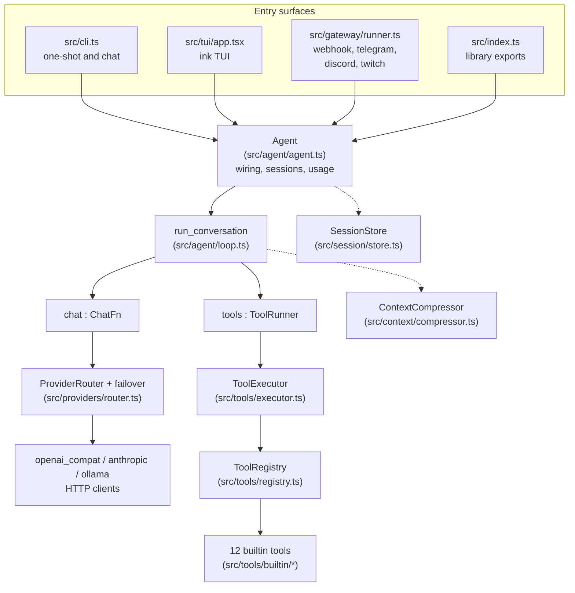

# Architecture Overview

Lich v0.3.0 is a small TypeScript AI agent harness: it drives a chat model in a
think-act-observe loop, lets the model call tools, compresses history when the
context budget demands it, and persists transcripts. It runs on Bun, is ESM
with NodeNext resolution, and its only runtime dependencies are `zod` (config
validation) and `ink` (the TUI). Everything else is Node/Bun built-ins.

This page is the map. The follow-up pages go deep on each area:
[agent loop](./agent-loop.md), [providers](./providers.md),
[tools](./tools.md), and [extending](./extending.md).

## Layer diagram



Solid edges are direct calls; dashed edges are side services the loop and the
agent use between turns.

## The dependency-inversion story

The loop is the heart of the system, and it deliberately imports **no**
concrete router and **no** concrete executor. It defines two narrow
structural interfaces ([`src/agent/loop.ts`](../../src/agent/loop.ts)):

- `ChatFn` - `(messages, tools, options?) => Promise<ChatResult>` (declared in
  `src/context/compressor.ts`, since compression needs the same shape).
- `ToolRunner` - `{ execute(name, args, context?) => Promise<ToolResult> }`.

`run_conversation` receives a `LoopDeps` object holding a `ChatFn`, a
`ToolRunner`, a `definitions()` callback for tool schemas, an optional
emitter, and an optional per-run `tool_context` threaded to every tool
execution. The `Agent` class (`src/agent/agent.ts`) is the composition root:
its `loop_deps()` method wires the real implementations -

```ts
chat: (messages, tools, chat_options) => this.router.chat_with_failover(messages, tools, chat_options),
tools: this.executor,
definitions: () => this.registry.definitions(),
emitter: this.events,
tool_context,
```

(src/agent/agent.ts, `loop_deps()`)

Why this matters:

- **Testability.** The loop tests (`test/loop.test.ts`) run against a queued
  fake `ChatFn` and a recording `ToolRunner`. No provider code, no HTTP, no
  file system is touched, yet every event-ordering and stopping-condition
  behavior is verified.
- **Swap-ability.** Compression reuses `ChatFn` to call the same model with a
  summarization prompt, so compression automatically benefits from the same
  failover chain as normal chat.
- **Small surface.** The loop cannot reach into provider configs, registries,
  or session state even by accident; the compiler enforces the boundary.

## Data flow of one user message

Walkthrough of a single `Agent.run({ input })` call
([`src/agent/agent.ts`](../../src/agent/agent.ts)):

1. **Usage collector attached.** `run()` subscribes a `collect_usage` handler
   on `agent.events`; every `llm_end` event adds the call's token usage into a
   per-run `Usage` total. The subscription is removed in a `finally` block.
2. **Seed messages.** The caller's `history` (if any) is copied into a fresh
   array and the new user message is appended. The caller's array is never
   mutated.
3. **Loop starts.** `run_conversation(deps, seed, params)` first applies the
   system prompt via `seed_system_prompt` (prepend, or replace an existing
   system message if its content differs) and then enters the turn loop
   described in [agent loop](./agent-loop.md).
4. **Each turn.** Abort check at the top of the turn, optional compression
   check, then one LLM call through the router (`chat_with_failover`, which
   walks providers with bounded in-place retries). The assistant message is
   pushed onto the history.
5. **Tools.** If the assistant message carries `tool_calls`, each call runs
   through the `ToolExecutor` (30 s timeout, abort linking, output clamping)
   and a `tool` message is appended per call. The loop then starts the next
   turn. A turn with no tool calls is the final turn.
6. **Outcome.** The loop returns a `LoopOutcome`: the full `messages` array,
   the final assistant message (or the last one seen), the last `ChatResult`
   on a real final, `turns_used`, and a `stopped_reason` of `final`, `budget`,
   or `aborted`.
7. **Session persist.** `persist_session()` appends one `meta` record
   (`run_start`), then one `message` record per outcome message, then a
   `budget_exhausted` meta record if the budget stopped the run, to a JSONL
   file under `session_dir` (default `<work_dir>/.lich/sessions`). Persistence
   is best-effort: failures are logged and the run still succeeds with
   `session_path: undefined`.
8. **Return.** `AgentRunResult` bundles the outcome, the full transcript
   (prior history plus the new exchange), the collected `usage_total`, and the
   session path.

## Concurrency model

- **One `Agent` instance, one conversation at a time per call.** `Agent.run()`
  is stateless across runs except for the shared, frozen `AgentConfig`: each
  run builds its own history array and its own usage total.
- **Gateway serialization.** `GatewayBus` (`src/gateway/bus.ts`) keeps a
  per-conversation promise chain (`chains` map keyed by `platform:chat_id`).
  Concurrent messages for the same conversation are serialized; different
  conversations run in parallel but share one `Agent`. Histories are capped
  (40 messages, 200 conversations, oldest-first eviction).
- **No shared mutable state across conversations.** The bus never shares a
  history array between keys; `Agent.run` copies what it is given. The TUI
  serializes naturally: submissions are ignored while a run is in flight.
- **Aborts flow down.** Every layer accepts an `AbortSignal` (`AgentRunOptions`
  -> `LoopParams` -> `ChatOptions` -> fetch signal; executor signal -> tool
  signal). See [agent loop](./agent-loop.md#abort-semantics) and
  [tools](./tools.md#executor-semantics).

## Directory map

| Path | Responsibility |
| --- | --- |
| `src/index.ts` | Public library surface; pure re-exports plus `LICH_VERSION`. |
| `src/cli.ts` | Zero-dependency CLI: one-shot, `chat`, `tui`, `gateway`, `config`. |
| `src/cli_config.ts` | Config file discovery, loading, flag overrides, template. |
| `src/agent/agent.ts` | `Agent`: wires router, registry, executor; sessions; usage. |
| `src/agent/loop.ts` | `run_conversation`: the think-act-observe loop. |
| `src/agent/config.ts` | Zod config schema, defaults, derived `session_dir`, freeze. |
| `src/agent/events.ts` | `AgentEmitter` and the `AgentEvent` discriminated union. |
| `src/context/compressor.ts` | `compress_messages`, `should_compress`, `ChatFn`. |
| `src/context/tokens.ts` | chars/4 token estimator used for budget decisions. |
| `src/session/store.ts` | Append-only JSONL transcripts; `read_session_messages`. |
| `src/providers/types.ts` | `Message`, `LLMProvider`, `ProviderConfig`, `ProviderError`. |
| `src/providers/openai.ts` | OpenAI-compatible chat-completions client. |
| `src/providers/anthropic.ts` | Anthropic Messages API client. |
| `src/providers/ollama.ts` | Ollama `/api/chat` client. |
| `src/providers/router.ts` | Provider registry, lazy construction, failover walk. |
| `src/providers/failover.ts` | Retry classification, deterministic backoff. |
| `src/tools/types.ts` | `Tool`, `ToolResult`, `ToolContext`, `Toolset`. |
| `src/tools/guard.ts` | Path confinement, timeouts, clamping, arg coercion. |
| `src/tools/registry.ts` | Name-keyed tool registry; duplicate rejection. |
| `src/tools/executor.ts` | Never-throw execution with timeout and abort. |
| `src/tools/builtin/*` | The 12 builtin tools (see [tools](./tools.md)). |
| `src/gateway/bus.ts` | Conversation-keyed runner over one shared `Agent`. |
| `src/gateway/runner.ts` | Adapter construction, signal handling, process lifetime. |
| `src/gateway/{telegram,discord,twitch,webhook}.ts` | Platform adapters. |
| `src/tui/state.ts` | Pure TUI state machine (no ink imports). |
| `src/tui/app.tsx` | Ink components wiring events into the state machine. |
| `src/util/*` | `safe_json_parse`/`safe_stringify`/`truncate_text`, `sleep`, logger, JSON Schema types. |

## Design trade-offs

- **No token streaming in the TUI.** Providers return complete messages; the
  TUI shows phase (`thinking`/`tool`) rather than streaming text. This keeps
  every provider client a simple request/response mapping.
- **chars/4 token estimate** (`src/context/tokens.ts`). Budget decisions do
  not need exact token counts; a coarse estimator avoids per-provider
  tokenizer dependencies at the cost of ~10-20% error.
- **Per-run history, capped in the gateway.** Long gateway conversations keep
  the newest 40 messages; compression further protects the context budget.
- **One shared agent in the gateway.** Simpler than one agent per conversation;
  isolation comes from per-conversation histories and the bus promise chains.