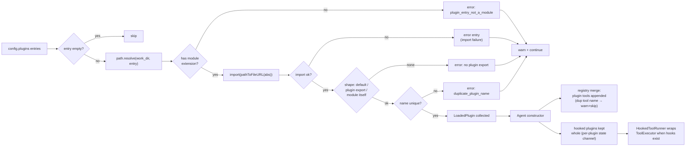

# Plugin architecture

How the plugin system loads user modules, merges tools into the registry, and intercepts tool calls with hooks. Sources: [`loader.ts`](../../src/plugins/loader.ts), [`hooks.ts`](../../src/plugins/hooks.ts), [`types.ts`](../../src/plugins/types.ts).

## Loader flow

`create_agent_with_plugins` parses the config, loads every entry from `config.plugins`, then hands `LoadedPlugin[]` to the `Agent` constructor. Each entry is resolved against `work_dir`, dynamically imported, and validated by shape; failures accumulate as error strings instead of throwing.



Three export shapes are accepted, checked in order: `default` export, a named `plugin` export, or the module object itself (top-level `name` plus `tools`/`hooks`). A bare object with just a `name` is rejected as a module-shape plugin (the `tools`/`hooks` surface must be present) to avoid treating arbitrary objects as plugins.

## HookedToolRunner interception

When any plugin provides hooks, `Agent` wraps the `ToolExecutor` in a `HookedToolRunner` and the loop's `ToolRunner` dependency points at the wrapper instead. The loop is unchanged — it still calls `execute(name, args, context)`.

```mermaid
sequenceDiagram
    participant L as loop (run_tool_calls)
    participant H as HookedToolRunner
    participant B as before_tool_call hooks
    participant E as ToolExecutor
    participant A as after_tool_call hooks

    L->>H: execute(name, args, context?)
    H->>B: await hook(info, ctx) in order
    B-->>H: {block: true, reason}?
    alt first blocker wins
        H-->>L: {ok: false, output: "", error: "blocked_by_plugin: reason"}
    else no blocker
        H->>E: execute(name, args, context?)
        E-->>H: ToolResult
        H->>A: await hook({...info, result_summary, ok, error?}, ctx)
        note over A: summary = 300 chars of output/error; ok/error are structured
        H-->>L: ToolResult unchanged
    end
```

Lifecycle fan-outs live on the same wrapper: `Agent.run` calls `call_run_start({input_chars})` before `run_conversation` and `call_run_end({stopped_reason, turns_used})` after it (including the abort/throw path, via `finally`). Both are best-effort: hook throws are logged at `warn` and the run proceeds.

## Builtin gatekeeper

`Agent` constructs `gatekeeper_plugin` in code, before config plugins, and
pushes it as a synthetic `LoadedPlugin` through tool registration and the
hook runner. The config loader never sees it. Construction failure means
`git_commit` is not in the registry at all. "No gatekeeper → no `git_commit`"
is that trusted path: with the gatekeeper off, a config plugin may still name
a tool `git_commit` (the documented plugin-trust floor). While the gatekeeper
is registered, first-wins keeps its tool.

`LICH_ALLOW_SELF_COMMIT` is read from process env at construction. The spec
value is `1`. Unset or any other value is fail-closed.

Per-run state starts `tests_ok=false`, `dirty=true`, `commits=0` (swapped at
`call_run_start`). `after_tool_call` updates only on structured `ok`:

- `write_file` / `edit_file` success → `dirty=true`
- `run_tests` success → `tests_ok=true`, `dirty=false`
- `git_commit` success → `commits++`

`before_tool_call` vetoes `git_commit` unless
`allow_self_commit && tests_ok && !dirty && commits < 1`. The reason names
the failed condition: `self_commit_disabled`, `tests_not_ok`,
`worktree_dirty`, `commit_budget_exhausted`. The model sees
`blocked_by_plugin: <reason>`.

`terminal` is vetoed on a hardcoded denylist match; the reason is
`git_denylist: <pattern>`. Patterns: flag-tolerant `commit` and `push`
(`commit`, `-commit`, `--commit`, `push`, `-push`, `--push`) plus
any-occurrence `commit-tree` and `update-ref`. No `remote` pattern. One
commit per run, hardcoded.

`git_commit` args are `{message, paths}` with 1–50 paths relative to
`work_dir`. It rejects `""`, `.`, anything resolving to `work_dir`, and
secret-ish basenames (`.env`, `.env.local`, `*.pem`, `*.p12`, `id_rsa*`).
Unreachable `HEAD` is fail-closed. Recipe: scoped `git add -- <paths>`, then
`git commit --only` with explicit identity `-c` flags. `timeout_ms` is 60000.
It never pushes.

**Attestation:** clean state attests no `write_file`/`edit_file` since the
last green `run_tests`; it does NOT attest absence of terminal-mediated
writes — that sits with the documented terminal floor.

Floors, stated not closed:

- Terminal floor: raw `terminal` can run arbitrary git; the denylist is
  best-effort. The boundary is human review of the local repo; push is
  human-only.
- Plugin-trust floor: `.lich/config.json` `plugins` is persistent arbitrary
  code at next process start. Review config diffs.
- One lich process per repo (the `run_tests` mutex is process-local).

## Design decisions

- **Explicit entries, no directory scan.** v1 loads only the files you list in `config.plugins`. Directory scanning would make runs depend on whatever happens to sit in a folder — non-reproducible, and a footgun for tools that write into `.lich/`. Explicit entries make the agent's tool surface a function of the config alone.
- **Observe-then-veto, not middleware.** `before_tool_call` may allow or veto but not rewrite args or results. Full middleware (argument rewriting, result transforms, ordering control) is a much larger design surface; v1 ships the 90% use case — guarding and auditing — with semantics simple enough to reason about: hooks run in config order and the first blocker wins.
- **Sync constructor + async factory.** `new Agent(config, plugins)` stays synchronous so existing callers and tests are untouched; the async work (dynamic imports) lives in `create_agent_with_plugins`. The trade-off: callers who construct `Agent` directly must load plugins themselves — documented in the library guide.
- **Errors as data.** The loader returns `{plugins, errors}` and `plugin_errors_summary` renders one warn line. Startup never crashes because one entry is broken, but misconfiguration is still visible in logs.

## Extension surface

| Export | Kind | Purpose |
| --- | --- | --- |
| `Plugin` | type | `{name, version?, tools?, hooks?}` — what a plugin module exports. |
| `PluginHooks` | type | The four optional lifecycle hooks with their signatures. |
| `HookContext` | type | `{work_dir, state?}` passed to every hook; `state` is the invoking plugin's own per-run bag. |
| `AfterToolCallInfo` | type | Tool name/args plus the 300-char `result_summary` and structured `ok`/`error` fields. |
| `LoadedPlugin` | type | `{plugin, entry}` — a loaded plugin and its source path. |
| `load_plugins` | function | `(entries, base_dir) => {plugins, errors}` — dynamic import + shape validation. |
| `plugin_errors_summary` | function | Joins error entries into one warn-able string. |
| `HookedToolRunner` | class | Wraps any `{execute}` runner with before/after interception. |
| `create_agent_with_plugins` | function | Parse config → load plugins → build `Agent` (warns on errors). |
| `config.plugins` | config | `string[]` of entry module specifiers relative to `work_dir`. |

## Invariants

1. A bad plugin never crashes startup: import failures, missing exports, and duplicate names all become error entries.
2. Hooks and tools from later plugins cannot break earlier ones — every hook call is wrapped in try/catch with a `warn`.
3. Plugin tools cannot shadow builtin or other plugin tools: duplicate registration is a warn + skip, so the visible tool set is deterministic given a config.
4. The `ToolRunner` interface (`execute(name, args, context?)`) is structural — `HookedToolRunner` satisfies it without importing the loop.
5. No new dependencies: loading uses `import()` + `node:url`, registration uses the existing `ToolRegistry`.