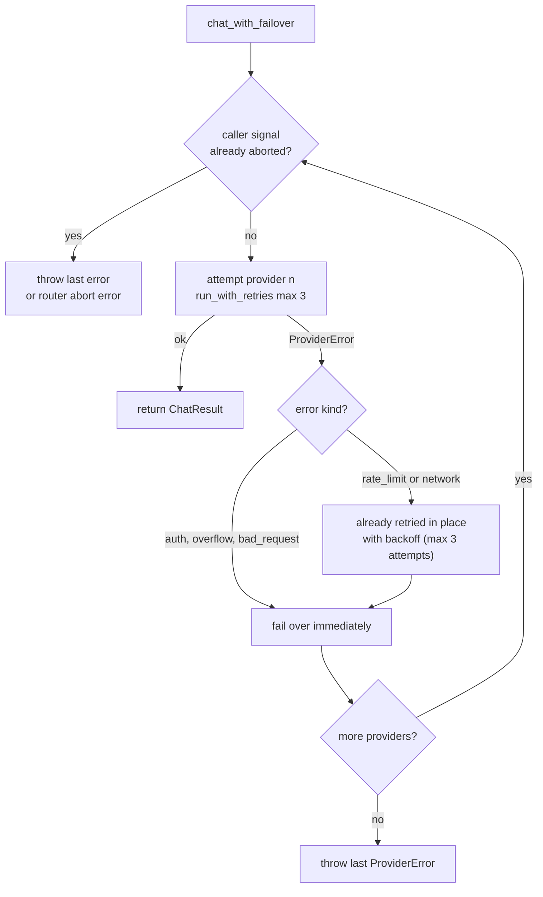

# Providers

Providers are the LLM adapters. Each one implements the same narrow interface
([`src/providers/types.ts`](../../src/providers/types.ts)) and knows nothing
about the agent loop; the router and failover layer above them know nothing
about any individual provider's wire format.

## The `LLMProvider` contract

```ts
export interface LLMProvider {
  readonly name: string;
  readonly model: string;
  chat(
    messages: readonly Message[],
    tools: readonly ToolDefinition[],
    options?: ChatOptions,
  ): Promise<ChatResult>;
}
```

(src/providers/types.ts)

- **`Message`** is a union of four shapes: `system` and `user` (plain text
  `content`), `assistant` (text plus optional `tool_calls`), and `tool` (a
  result keyed by `tool_call_id` and `name`, with optional `is_error`).
- **`ToolDefinition`** is `{ name, description, parameters }` where
  `parameters` is a JSON Schema object - passed through to providers verbatim.
- **`ChatResult`** carries the parsed `AssistantMessage`, token `Usage`, a
  `finish_reason`, and the resolved `model` / `provider_name`.
- **`ChatOptions`** are `temperature`, `max_tokens`, `signal`, and one
  ollama-only hint (`think`). Providers ignore what they do not support.

Every provider maps its HTTP/JSON wire dialect onto this contract and maps
every failure onto `ProviderError` with a `kind` from a fixed taxonomy. A
provider either resolves with a `ChatResult` or throws `ProviderError` (or a
raw `TypeError` from fetch, which the failover layer classifies as
`network`).

### Finish-reason philosophy

`FinishReason` is `"stop" | "tool_calls" | "length" | "error" | "unknown"`.
The mapping philosophy: **`tool_calls` is derived from tool-call presence, not
from the provider's done/stop reason.** The reason string is informational;
the loop only branches on `message.tool_calls` (see
[agent loop](./agent-loop.md)).

This is load-bearing because of an ollama quirk: Ollama reports
`done_reason: "stop"` even when the response contains tool calls. The ollama
client documents this inline as "load-bearing":

```ts
/**
 * Load-bearing mapping: Ollama reports done_reason "stop" even when tool
 * calls are present, so presence of tool_calls wins over done_reason.
 */
function map_done_reason(done_reason: string | undefined, has_tool_calls: boolean): FinishReason {
  if (has_tool_calls === true) {
    return "tool_calls";
  }
  ...
}
```

(src/providers/ollama.ts)

## Client walkthroughs

All three clients share the same skeleton: resolve auth, build endpoint and
JSON body from typed DTOs, fetch (injectable `fetch_fn`), throw `ProviderError`
on non-OK or unparseable bodies, parse the success body into `ChatResult`.
They differ in wire mapping.

### OpenAI-compatible (`src/providers/openai.ts`)

Endpoint: `POST {base_url}/chat/completions`, header `authorization: Bearer`.
Roles map 1:1; there is no message restructuring at all.

| Our `Message` | Wire format |
| --- | --- |
| `system` / `user` | `{ role, content }` verbatim |
| `assistant` | `{ role: "assistant", content, tool_calls?: [{ id, type: "function", function: { name, arguments } }] }` - **`arguments` is JSON-stringified** via `safe_stringify` |
| `tool` | `{ role: "tool", tool_call_id, content }` - 1:1, one wire message per tool message |
| `ToolDefinition` | `{ type: "function", function: { name, description, parameters } }` |

Response parsing: `choices[0].message`, string `arguments` parsed with
`safe_json_parse` (unparseable args become `{}` plus a
`[unparseable tool arguments]` note appended to the content), `finish_reason`
mapped `stop`/`tool_calls`/`length` verbatim, missing total tokens recomputed
as prompt + completion.

### Anthropic (`src/providers/anthropic.ts`)

Endpoint: `POST {base_url}/v1/messages`, headers `x-api-key` and
`anthropic-version: 2023-06-01`. Two structural differences from our model:

| Our `Message` | Wire format |
| --- | --- |
| `system` (any position, any count) | Hoisted to top-level `system` string; all system contents joined with `\n`. Not part of `messages`. |
| `assistant` | `{ role: "assistant", content: blocks }` - a `text` block plus one `tool_use { id, name, input }` block per call; `input` is a **JSON object** |
| consecutive `tool` messages | **Merged into one `user` turn** whose content is the `tool_result` blocks (`tool_use_id`, text content, `is_error` passthrough) |
| `ToolDefinition` | `{ name, description, input_schema: parameters }` |

Why the merge: the Messages API requires strictly alternating user/assistant
roles, and tool results must be delivered as `tool_result` blocks inside a
`user` turn. The loop naturally produces several `tool` messages after one
assistant turn (one per call), so `to_anthropic_turns` buffers them
(`pending_tool_results`) and flushes them as a single user turn when the next
non-tool message arrives.

`max_tokens` is **required** by the API, so it defaults to 4096 when
`options.max_tokens` is absent. `stop_reason` maps: `end_turn` -> `stop`,
`tool_use` -> `tool_calls`, `max_tokens` -> `length`.

### Ollama (`src/providers/ollama.ts`)

Endpoint: `POST {base_url}/api/chat`. Quirks, each deliberate:

| Aspect | Behavior |
| --- | --- |
| Streaming | `stream: false` is always sent; the client wants one complete JSON body. |
| Tool-call arguments | **JSON objects both ways**: requests send `function.arguments` as an object; responses accept an object, tolerate a JSON string (some proxies send one), and fall back to `{}` with a `[unparseable tool arguments]` note. |
| Tool results | Ollama has no tool-call ids: tool messages are sent 1:1 with `tool_name` (not `tool_call_id` / `name`). Correlation is positional. |
| Tool-call ids | Ollama returns none, so the client synthesizes `ollama_<base36 time>_<counter>` per call. |
| `done_reason` | Reports `"stop"` even with tool calls; tool-call presence wins (above). |
| 200 with error | Ollama can return HTTP 200 with `{ "error": "..." }`; the client checks `dto.error` first and throws `bad_request`. A 200 without `message` is also `bad_request`. |
| Generation caps | `max_tokens` maps to `options.num_predict`; `temperature` also lives under `options`. |
| Extras | Config `think: true` adds `think: true`; `keep_alive` (e.g. `"10m"`) is forwarded. |

Usage comes from `prompt_eval_count` / `eval_count`.

## Error taxonomy

`ProviderErrorKind` and the mapping rules are identical across clients
(`status_to_error_kind` in each client), with one anthropic addition:

| Kind | Meaning | OpenAI mapping | Anthropic mapping | Ollama mapping |
| --- | --- | --- | --- | --- |
| `auth` | Missing/invalid credentials | 401, 403; missing key for api.openai.com (thrown before HTTP) | 401, 403; missing key (thrown before HTTP) | 401, 403 |
| `rate_limit` | Retryable throttling/instability | 429 and **any 5xx** | 429, **529 (overloaded)**, and any 5xx | 429 and any 5xx (529 falls under >= 500) |
| `overflow` | Context window exceeded | 400 whose body matches `/context\|token\|length/i` | 400 matching `/context\|token\|maximum/i` | 400 matching `/context\|token\|maximum\|too long/i` |
| `bad_request` | Everything else non-ok | 4xx not above; unparseable 2xx bodies | same | same, plus 200-with-error bodies |
| `network` | Fetch failed / aborted / timed out | fetch throws; body read failures; abort-like errors (`AbortError`, `TimeoutError`) | same | same |
| `unknown` | Anything else | non-`ProviderError` throwers get wrapped by the router with kind `unknown` | same | same |

Additional mapping details shared by all clients:

- `Retry-After` is parsed (seconds, floored at 0) into `retry_after_ms` on the
  error; the retry layer honors it as a delay floor.
- Error bodies are truncated to 500 chars in the message.
- `classify_error` (`src/providers/failover.ts`) maps non-`ProviderError`
  throwers: abort-like or `TypeError` (fetch's network failure signature)
  become `network`; everything else `unknown`.

## Router and failover

`ProviderRouter` (`src/providers/router.ts`) holds the config list and
constructs providers **lazily**: `get(name)` builds a client on first use and
caches it in a `Map`; `build_provider` is a small kind map
(`anthropic` -> `AnthropicProvider`, `ollama` -> `create_ollama_provider`,
everything else -> `OpenAICompatProvider`). Construction is cheap and side
effect free, so lazy vs eager is only an optimization - but it keeps
construction failures (there are none today; even missing keys throw at chat
time) out of config parsing.

`chat_with_failover` walks providers **in config order**:



`run_with_retries` (`src/providers/failover.ts`) retries only `rate_limit` and
`network` kinds, up to `max_attempts` (the router passes 3). Everything else
rethrows immediately, so auth/overflow/bad_request fail over to the next
provider on the first attempt.

**Backoff.** `compute_backoff_ms` is deterministic (no `Math.random`, per repo
convention):

```text
exponential = floor(500 * 2**attempt)        // attempt is 1-based
jitter      = floor((500 * attempt) / 2)
delay       = min(exponential + jitter, 8000)
```

Attempt 1 waits 1250 ms, attempt 2 waits 2500 ms. The fixed jitter term
spreads simultaneous callers without nondeterminism (tests assert exact
values).

**`Retry-After` floor.** If the failed call produced `retry_after_ms` larger
than the computed backoff, the server value wins (`delay_for_error`).

**Abort semantics.** A caller abort is checked in three places: before each
provider in the router walk, after each failed attempt in the retry loop, and
during the backoff sleep itself (`sleep` rejects on abort, and the abort is
re-checked right after). Aborts rethrow immediately - they never trigger a
retry and never advance to the next provider. The router rethrows the last
provider error when the caller had already aborted mid-walk.

The retry loop is a `while` loop, never recursion (repo convention).

## `ProviderConfig` reference

| Field | Applies to | Meaning |
| --- | --- | --- |
| `kind` | all | `"openai_compat" \| "anthropic" \| "ollama"` - selects the client. |
| `name` | all | Router key and `provider_name` on results/errors. |
| `model` | all | Model identifier sent to the API. |
| `base_url` | all | API root; per-kind default (`api.openai.com/v1`, `api.anthropic.com`, `localhost:11434`). |
| `api_key` | all (used by all three) | Direct key. Ollama treats it as optional proxy auth. |
| `api_key_env` | all | Env var to read the key from; per-kind default below. |
| `timeout_ms` | all | Per-call `AbortSignal.timeout`, merged with the caller signal. |
| `think` | ollama | Adds `think: true` to the request (thinking mode). |
| `keep_alive` | ollama | Model residency hint forwarded verbatim (e.g. `"10m"`). |
| `fetch_fn` | all | Injectable fetch for tests; defaults to global `fetch`. |

Env resolution rules per kind (who needs a key, and fallback order):

| Kind | Key required? | Resolution order |
| --- | --- | --- |
| `openai_compat` | Only for the well-known host `api.openai.com` | `api_key` -> `api_key_env` -> `OPENAI_API_KEY` (well-known host only) |
| `anthropic` | Always | `api_key` -> `api_key_env` -> `ANTHROPIC_API_KEY` |
| `ollama` | Never | `api_key` -> `api_key_env`; if one resolves, a `Bearer` header is sent for cloud proxies |

The openai rule is host-based on purpose: custom `base_url`s (LM Studio,
vLLM, OpenRouter-style gateways) may not want a key, so a missing key is only
fatal for `api.openai.com`, where it is guaranteed to fail. A missing
required key throws `auth` before any HTTP request is made.

## Testing pattern

Provider tests inject a `fetch_fn` and assert on captured requests with
canned `Response` bodies - no network, no mocking library
(`test/providers.test.ts`):

```ts
function mock_fetch(responder: (request: CapturedRequest) => MockReply): {
  fetch_fn: typeof fetch;
  requests: CapturedRequest[];
} {
  const requests: CapturedRequest[] = [];
  const fetch_fn: typeof fetch = (input, init) => {
    const request: CapturedRequest = { url: String(input), init: init ?? {} };
    requests.push(request);
    const reply = responder(request);
    const body_text = reply.text_body ?? JSON.stringify(reply.body ?? {});
    return Promise.resolve(new Response(body_text, { status: reply.status, headers: reply.headers }));
  };
  return { fetch_fn, requests };
}
```

(test/providers.test.ts)

Each test constructs the provider with `{ ...config, fetch_fn }`, calls
`chat`, then asserts on `requests[i].url`, parsed `init.body` (wire mapping)
and the returned `ChatResult` (response mapping). Error paths return canned
non-200 statuses or malformed bodies and assert the resulting
`ProviderError.kind`. The same pattern drives the ollama quirk tests
(`test/providers_ollama.test.ts`, including a 200-with-error body) and the
failover walk (`test/failover.test.ts`). See
[extending](./extending.md#add-a-provider) for the full recipe.