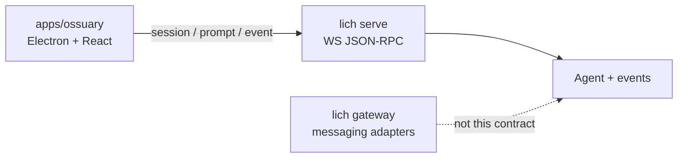

# Serve protocol

`lich serve` is the **desktop/TUI-grade** control surface for a headless Agent.
Ossuary (and later other rich clients) talk to it over loopback WebSocket
JSON-RPC. It is **not** the messaging gateway (`lich gateway` /
`POST /message`): gateway adapters deliver chat replies to Telegram, Discord,
Twitch, or an HTTP webhook; serve owns sessions, live `AgentEvent` streaming,
and abort.

This page documents the shared contract in
[`src/serve/protocol.ts`](../../src/serve/protocol.ts) and the loopback
WebSocket transport in [`src/serve/server.ts`](../../src/serve/server.ts).
Session/prompt RPC and the `lich serve` CLI land in follow-up issues.

## Role in the system

- **Serve** — one process, loopback only, token-gated; server-owned
  conversation history; pushes `AgentEvent` as notifications.
- **Gateway** — multi-platform messaging bus; final text out, no Dockview-grade
  event stream. Do not build ossuary panels on the webhook.

## JSON-RPC shape

Standard JSON-RPC 2.0 envelopes (`jsonrpc: "2.0"`, `id` on requests/responses).
Requests use the locked method names below. Server → client notifications use
method `event` (no `id`).

## Methods (locked names)

| Method | Params | Result |
| --- | --- | --- |
| `health` | `{}` | `{ status: "ok", version }` (`LICH_VERSION`) |
| `session.create` | `{ label?, source }` | `{ session_id }` |
| `session.list` | `{}` | `{ sessions: [{ id, mtime_ms }, ...] }` |
| `session.clear` | `{ session_id }` | `{ session_id }` |
| `prompt.submit` | `{ session_id, text }` | reply, usage, `session_path`, `stopped_reason`, … |
| `prompt.abort` | `{ session_id }` | `{ session_id, aborted }` |

`health` and `session.list` have no param fields. Typed clients still send
`params: {}`, because `ServeRequest` requires `params`. JSON-RPC 2.0 also
allows omitting `params`; serve handlers accept that omission the same as `{}`.

`session.resume` and other session RPCs may extend this map in later issues;
clients must not invent method names outside the locked set above until those
land.

## Notifications

| Method | Params |
| --- | --- |
| `event` | `{ session_id, event }` where `event` is an [`AgentEvent`](../../src/agent/events.ts) (same discriminated union the TUI consumes) |

Events are 1:1 with the in-process emitter — `turn_start`, `llm_*`,
`tool_call_*`, `final`, `error`, and the rest — so a Chat pane can mirror TUI
semantics without embedding `Agent` in Electron.

## Transport (loopback)

- Bind `127.0.0.1` only (or other loopback aliases); port `0` picks an ephemeral port.
- On listen, emit **one** stdout JSON line: `{"port":…,"token":…}` for Electron to parse.
- WebSocket upgrade requires the token via `?token=` or `x-lich-token` (mismatch → 401).
- `health` returns `{ status: "ok", version }` (`LICH_VERSION` / package version).

## Not in this layer yet

- No `lich serve` CLI entry (#84).
- No `session.*` / `prompt.*` handlers (#82 / #83) — locked names return method-not-found until implemented.
- No Agent construction or session file I/O.
