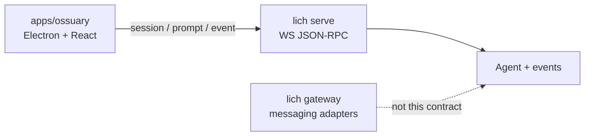

# Serve protocol

`lich serve` is the **desktop/TUI-grade** control surface for a headless Agent.
Ossuary (and later other rich clients) talk to it over loopback WebSocket
JSON-RPC. It is **not** the messaging gateway (`lich gateway` /
`POST /message`): gateway adapters deliver chat replies to Telegram, Discord,
Twitch, or an HTTP webhook; serve owns sessions, live `AgentEvent` streaming,
and abort.

This page documents the shared contract in
[`src/serve/protocol.ts`](../../src/serve/protocol.ts), the loopback
WebSocket transport in [`src/serve/server.ts`](../../src/serve/server.ts),
and prompt/event handling in [`src/serve/prompts.ts`](../../src/serve/prompts.ts).
Start it with `lich serve` (or `bun src/cli.ts serve`).

## Role in the system

- **Serve** — one process, loopback only, token-gated; server-owned
  conversation history; pushes `AgentEvent` as notifications.
- **Gateway** — multi-platform messaging bus; final text out, no Dockview-grade
  event stream. Do not build ossuary panels on the webhook.

## JSON-RPC shape

Standard JSON-RPC 2.0 envelopes (`jsonrpc: "2.0"`, `id` on requests/responses).
Requests use the locked method names below. Server → client notifications use
method `event` (no `id`).

## Methods (locked names)

| Method | Params | Result |
| --- | --- | --- |
| `health` | `{}` | `{ status: "ok", version }` (`LICH_VERSION`) |
| `session.create` | `{ label?, source }` | `{ session_id }` |
| `session.list` | `{}` | `{ sessions: [{ id, mtime_ms }, ...] }` |
| `session.clear` | `{ session_id }` | `{ session_id }` |
| `session.resume` | `{ id, source? }` | `{ session_id, resumed_id, message_count }` |
| `prompt.submit` | `{ session_id, text }` | reply, usage, `session_path`, `stopped_reason`, … |
| `prompt.abort` | `{ session_id }` | `{ session_id, aborted }` |

`health` and `session.list` have no param fields. Typed clients still send
`params: {}`, because `ServeRequest` requires `params`. JSON-RPC 2.0 also
allows omitting `params`; serve handlers accept that omission the same as `{}`.

Clients must not invent method names outside the locked set above.

`session.create` opens one `SessionHandle` and an empty in-memory history bag,
and eagerly creates the (empty) `.jsonl` transcript so `session.list` sees the
new id immediately — before any prompt appends to it.
`session.clear` resets that bag's in-memory history (handle stays; the on-disk
transcript is untouched). `session.list` / `session.resume` reuse
[`resolve_session_path`](../../src/session/resolve.ts) / transcript listing
semantics from CLI `--resume` and TUI `/sessions`. `session.resume` seeds
history from disk and opens a fresh `SessionHandle` for later `prompt.submit`
— like CLI `--resume`, each resume forks a new transcript; it does not
re-bind the original. The fork is written from the filtered bag history
(every trailing user already dropped by `read_session_messages`), not a raw byte
copy, and the handle is marked seeded so a later `prompt.submit`
`recorder.seed` appends only the new turn. A later `latest` resume (or the
fork id after a restart) reloads that filtered history. A transcript that is
deleted between resolve and read resumes as `not_found`, never as an empty
history.
`SessionResumeResult.resumed_id` reports which
transcript was resolved, even for `latest` / prefix resumes.

In-memory bags are capped (LRU, default 32 via `max_session_bags`): the
oldest is evicted first, and `ServeServer.stop()` drops all of them — after
draining in-flight RPC handlers, so a mid-I/O `session.create` /
`session.resume` cannot resurrect a bag after shutdown. Eviction is log-only
— there is no client notification; a client operating on an evicted id learns
about it from the next `session.clear` or `prompt.submit` failing with
`not_found`. Evicted transcripts stay on disk and can be resumed again.

`prompt.submit` runs the server Agent with that bag's history and
`AgentRunOptions.session` (one JSONL file per serve session). Runs are serialized
so AgentEvent fan-out stays correctly tagged with `session_id`. While a run is
in flight, `prompt.abort` aborts it via `AbortSignal`. The submit result mirrors
`AgentRunResult` (`reply`, `usage`, `session_path`, `turns_used`, `stopped_reason`).

## Notifications

| Method | Params |
| --- | --- |
| `event` | `{ session_id, event }` where `event` is an [`AgentEvent`](../../src/agent/events.ts) (same discriminated union the TUI consumes) |

Events are 1:1 with the in-process emitter — `turn_start`, `llm_*`,
`tool_call_*`, `final`, `error`, and the rest — so a Chat pane can mirror TUI
semantics without embedding `Agent` in Electron. Notifications are pushed on the
same WebSocket that issued `prompt.submit` while the call is still in flight.

## Transport (loopback)

- Bind `127.0.0.1` only (or other loopback aliases); port `0` picks an ephemeral port.
- On listen, emit **one** stdout JSON line: `{"port":…,"token":…}` for Electron to parse.
- Upgrade checks, in order:
  1. **`Host`** must be a loopback name (`127.0.0.1`, `localhost`, `::1`, with optional
     port) — otherwise **403** (DNS-rebinding defense).
  2. **Token** via query `?token=` or header **`x-lich-token`** (preferred for clients
     that should not put secrets in URLs / logs) — mismatch or missing → **401**.
- Origin allowlisting is deferred until Electron’s page origin policy is decided;
  do not assume `file://` / `app://` behavior here.
- Frame size capped at ~1 MiB (`maxPayload`).
- `health` returns `{ status: "ok", version }` (`LICH_VERSION` from `src/version.ts`).
- Frames are handled per-connection in arrival order: pipelined requests get
  in-order replies even when earlier requests hit slower filesystem awaits.
  `prompt.abort` is dispatched immediately so it can cancel an in-flight
  `prompt.submit` on the same socket instead of waiting behind that run.
- Pass `agent` or `agent_config` (same shape as CLI / `create_agent_with_plugins`) so
  `prompt.*` is available; without an agent, those methods return an application error.
- **CLI:** `lich serve [--host 127.0.0.1] [--port 0]` builds the Agent from the same
  config resolution as TUI/chat and passes it as `agent_config` with
  `session_dir` from the agent config (`${work_dir}/.lich/sessions`). The library
  default when `session_dir` is omitted remains `<cwd>/.lich/sessions`.
