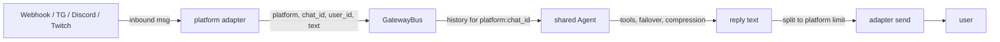

# Gateway guide

> What you'll learn: how `lich gateway` bridges Telegram, Discord, Twitch, and an HTTP webhook into one shared agent, how to set up each platform, and the webhook API reference.

## How it works

`lich gateway <platform...>` runs a long-lived process that forwards inbound chat messages to **one shared agent** and routes replies back. Per-conversation memory is keyed `platform:chat_id` (Telegram/Discord chat ids, Twitch channel names, webhook `chat_id` field): each conversation keeps its own bounded history capped at 40 messages (oldest evicted; conversations beyond 200 are evicted oldest-first). Messages for the same conversation are serialized, so overlapping messages never interleave histories; different conversations can run concurrently. Failures become a safe one-line reply: `agent error: <flattened message, 300 chars max>`.



Platforms: `webhook` (HTTP server), `telegram` (long-poll), `discord` (gateway WebSocket), `twitch` (IRC over WebSocket). Pick any combination:

```sh
bun src/cli.ts gateway webhook                 # http only
bun src/cli.ts gateway webhook telegram        # http + telegram polling
bun src/cli.ts gateway telegram discord twitch # no webhook server
bun src/cli.ts gateway                         # defaults to webhook
```

The gateway is silent after startup: Telegram/Discord/Twitch respond only in chats, channels, or servers the bot can see or has joined, and the webhook only serves HTTP. Telegram media messages arrive as the placeholder text `media not supported yet`; other non-text events are ignored. Telegram `/start` is answered like a plain "hello".

## Setup: webhook

Zero configuration — the server binds `0.0.0.0:$LICH_GATEWAY_PORT` (default 8089).

```sh
bun src/cli.ts gateway webhook
```

```sh
curl -s -X POST http://localhost:8089/message \
  -H "content-type: application/json" -d '{"text": "hello"}'
# -> {"reply":"...","usage":null}

curl -s http://localhost:8089/health
# -> {"status":"ok"}
```

With token auth, every POST must carry the exact `x-lich-token` header; mismatched or missing tokens get `401 {"error":"unauthorized"}`:

```sh
LICH_GATEWAY_TOKEN=s3cret bun src/cli.ts gateway webhook
curl -s -X POST http://localhost:8089/message \
  -H "x-lich-token: s3cret" -H "content-type: application/json" -d '{"text": "hello"}'
```

Payload fields (all optional except `text`): `platform` (default `"webhook"`), `chat_id` (default `"default"`), `user_id` (default `"anonymous"`), `text` (required; missing `text` is a `400`). Use distinct `chat_id` values to keep independent conversation memories.

## Setup: Telegram

1. Message [@BotFather](https://t.me/BotFather) → `/newbot` → copy the token.
2. Export it and run:

```sh
export LICH_TELEGRAM_BOT_TOKEN=123456:ABC-your-token
bun src/cli.ts gateway telegram
```

3. Open your bot in Telegram, send a message, get a reply. Media messages arrive as the text `media not supported yet`; the bot replies from there.

Telegram uses long polling (no public URL needed). Replies split at 4096 chars.

## Setup: Discord

1. Create an application at the [Discord developer portal](https://discord.com/developers/applications), add a **Bot**, and copy the bot token.
2. Enable the **Message Content Intent** (Bot settings → Privileged Gateway Intents) — the adapter requests intents `512 | 32768`, which includes message content.
3. Invite the bot with the `bot` scope (OAuth2 → URL Generator; no extra permissions needed beyond sending messages in target channels).
4. Export the token (and the bot's application/user id, so leading `<@BOT_ID>` mentions are stripped) and run:

```sh
export LICH_DISCORD_BOT_TOKEN=your-bot-token
export LICH_DISCORD_BOT_ID=123456789012345678
bun src.cli.ts gateway discord
```

5. Send the bot a message (DM or any channel it can read — every non-bot message gets a reply); each channel has its own conversation memory (keyed by `channel_id`). Replies split at 2000 chars. Bot-authored messages are ignored (no loops).

**Known limitation:** the Discord adapter has no reconnect resume. If its gateway WebSocket drops, messages sent while offline are missed permanently; the adapter reconnects fresh after 5s. If guaranteed delivery across disconnects matters, run webhook or Telegram instead.

## Setup: Twitch

1. Generate an OAuth token with the `chat:read` and `chat:edit` scopes (for example via [twitchtokengen](https://twitchtokengen.com)).
2. Export it, your bot account's nickname, and the channels to join (comma-separated, lowercased by the adapter):

```sh
export LICH_TWITCH_OAUTH_TOKEN=oauth:abc123...
export LICH_TWITCH_NICK=mylichbot
export LICH_TWITCH_CHANNELS=channelone,channeltwo
bun src/cli.ts gateway twitch
```

3. The bot joins `#channelone` and `#channeltwo` and replies in chat (own messages are ignored). Replies split at 512 chars; IRC PING/PONG is answered automatically.

All three fields (`token`, `nick`, `channels`) are required — a missing one idles the adapter.

## Running multiple platforms at once

List the platforms in one command; all configured adapters start together and share the agent:

```sh
LICH_TELEGRAM_BOT_TOKEN=... LICH_DISCORD_BOT_TOKEN=... \
  bun src/cli.ts gateway webhook telegram discord
```

Adapters whose credentials are missing start **idle** (a warning is logged, e.g. `gateway discord adapter idle: LICH_DISCORD_BOT_TOKEN not set`) and the rest keep running — so the same command works on machines with partial credentials. If no platform name is valid, the CLI exits `1` with `gateway needs at least one valid platform`.

## Environment variables

| Variable | Default | Purpose |
| --- | --- | --- |
| `LICH_GATEWAY_PORT` | `8089` | Webhook server port (invalid/empty values fall back to 8089). |
| `LICH_GATEWAY_TOKEN` | unset | If set, POST `/message` requires header `x-lich-token` to match; else 401. |
| `LICH_TELEGRAM_BOT_TOKEN` | unset | Bot token from BotFather; adapter idles without it. |
| `LICH_DISCORD_BOT_TOKEN` | unset | Bot token from the developer portal; adapter idles without it. |
| `LICH_DISCORD_BOT_ID` | unset | Bot user id; strips a leading `<@id>` mention from messages. |
| `LICH_TWITCH_OAUTH_TOKEN` | unset | IRC oauth token (`oauth:` prefix optional); adapter idles without it. |
| `LICH_TWITCH_NICK` | unset | Bot account nickname; required with the token. |
| `LICH_TWITCH_CHANNELS` | unset | Comma-separated channels to join; required. |

Provider/model configuration comes from the same resolution as every mode (`LICH_MODEL` or config file).

## Operational notes

- **Graceful stop:** SIGINT (Ctrl+C) or SIGTERM stops every adapter, then exits `0`. No other signals are handled.
- **Idle adapters:** any adapter missing its token/credentials logs a warning once and does nothing; the process stays up for the others.
- **Message splitting:** replies are split per platform — Telegram 4096 chars, Discord 2000, Twitch 512. Telegram/Discord splits prefer whitespace; Twitch hard-cuts at the limit.
- **One shared agent:** all platforms share one agent instance, tool set, and provider failover chain; only conversation memory is per-chat.
- **Debugging tool calls:** with `--log-level debug`, completed tool calls are logged as `tool <name> ok|failed`.
- **Restart loses Discord messages:** see the [Discord note](#setup-discord) — the offline window is not replayed.

## Webhook API reference

### `POST /message`

Request:

```json
{"text": "hello", "platform": "webhook", "chat_id": "default", "user_id": "anonymous"}
```

Only `text` is required. Success (`200`):

```json
{"reply":"Hello! How can I help you today? ...","usage":null}
```

`reply` is the agent's final answer; `usage` is always `null` on this endpoint (webhook replies are formatted without usage stats, unlike the chat/TUI footers). Errors:

| Status | When |
| --- | --- |
| `400` | Body missing or has no `text` field: `{"error":"text is required"}`. |
| `401` | `LICH_GATEWAY_TOKEN` is set and the `x-lich-token` header does not match. |
| `404` | Anything other than `POST /message` or `GET /health`. |
| `500` | Internal dispatch failure: `{"error":"internal error"}`. |

Agent-level failures (e.g. every provider failed) return `200` with `reply` set to a sanitized one-line `agent error: ...` string, so callers always get a deliverable text.

### `GET /health`

`200 {"status":"ok"}` unconditionally — the webhook server itself is alive; it does not reflect platform adapters or provider health.