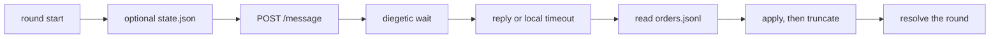

# Godot guide

> What you'll learn: how to run lich beside a Godot game — the webhook call, the `game_bridge` plugin path, and the `.lich/game/` files Godot drains. Godot never links lich.

lich is the AI brain in a separate process. Godot speaks HTTP. This page is the recipe; the file contract and tool list live in [`examples/game_bridge/README.md`](https://github.com/Moikapy/lich/blob/main/examples/game_bridge/README.md). Plugin authoring is the [plugins guide](plugins.md). Platform setup beyond the webhook is the [gateway guide](gateway.md). A TypeScript game backend that embeds the library uses the [library guide](library.md) — Godot itself does not.

## Architecture

Two tiers:

- **Dialogue.** `lich gateway webhook` plus a `chat_id`. No plugin. The reply text is the line.
- **Combat commander.** The same webhook, with [`examples/game_bridge/game_bridge.plugin.mjs`](https://github.com/Moikapy/lich/blob/main/examples/game_bridge/game_bridge.plugin.mjs) loaded. The model queues a round by calling `enemy_actions`. Godot never parses tool calls out of `reply`; it drains the order file the tool appends.

LLM latency is seconds, not frames. Call lich **once per combat round**, never per frame and never from input-handling logic. Mask the wait in the turn: the enemy commander looks over the field, then the round resolves. Do not start round N+1 for the same `chat_id` until round N's HTTP call has finished — the gateway already serializes that conversation, so an early follow-up only queues behind the slow one.



A game backend may instead call `run_agent`, which loads `config.plugins`. `create_agent` does not. Godot still reaches that backend over HTTP; it does not import the package. Several personas means several agents behind that HTTP process — the pattern is [`examples/persona_orchestrator`](../../examples/persona_orchestrator/README.md), and the service is the game's. Session replay is the [games guide](games.md).

## Gateway contract

`lich gateway webhook` binds `0.0.0.0` on `LICH_GATEWAY_PORT` (default `8089`). `GET /health` is `200 {"status":"ok"}` — the process is up, not that a provider is healthy. Check it before the first round.

`POST /message`. Only `text` is required. Omitted fields default to `platform` `"webhook"`, `chat_id` `"default"`, `user_id` `"anonymous"`.

```sh
LICH_GATEWAY_TOKEN=s3cret lich gateway webhook
```

```sh
curl -s -X POST http://127.0.0.1:8089/message \
  -H "x-lich-token: s3cret" -H "content-type: application/json" \
  -d '{"text":"round 1: hero1 at full. goblin is the only living enemy.","chat_id":"run-1"}'
```

Success is exactly one JSON object. This endpoint always sends `usage: null` — it does not forward provider token counts:

```json
{"reply":"...","usage":null}
```

| Status | Body |
| --- | --- |
| `400` | `{"error":"text is required"}` |
| `401` | `{"error":"unauthorized"}` when `LICH_GATEWAY_TOKEN` is set and `x-lich-token` does not match |
| `404` | `{"error":"not found"}` for any other method or path |
| `500` | `{"error":"internal error"}` if the handler throws before a response is sent |

A failed run is still `200`. `reply` is then a sanitized `agent error: ...` line. There is no streaming, pagination, or cursor. Full platform notes: [webhook API](gateway.md#webhook-api-reference).

Memory is keyed `platform:chat_id`, capped at 40 messages (oldest dropped) and 200 conversations (oldest dropped). For a roguelike, `chat_id` = the run id gives the commander that process's memory of the run. A new run id starts a fresh history. That history is in memory only — restarting the gateway clears it. Restate facts the digest still needs. Durable notes are a different file, below.

## Wire the example plugin

Node `>=20` loads the `.mjs` entry. Restart to reload; there is no hot reload. Paths in `config.plugins` are relative to `work_dir`.

If `work_dir` is the lich checkout:

```json
{
  "plugins": ["./examples/game_bridge/game_bridge.plugin.mjs"]
}
```

If `work_dir` is the game repo, copy the `examples/game_bridge/` folder into that repo and point `plugins` at the copy the same way. Restart the gateway (or whichever entry you use) after changing the list. The gateway loads plugins; a config entry is not ignored.

The prompt `text` is yours. The plugin does not parse it. Put the battle digest there — party, living enemies, kits, last round — as plain text or as JSON inside the string.

## Dialogue autoload

Sketch only. The game repo owns the real autoload. One `HTTPRequest` per in-flight call; `CONNECT_ONE_SHOT` so two speakers do not share a callback. Set `timeout` yourself (Godot's `0` means no timeout). On timeout, non-200, or a body that is not the object above, emit your own fallback and resolve the beat. Do not wait on the frame path.

```gdscript
# Sketch — not shipped as a Godot project in this repo.
extends Node
signal reply_received(text: String)
var request: HTTPRequest

func _ready() -> void:
	request = HTTPRequest.new()
	request.timeout = 45.0
	add_child(request)

func ask(chat_id: String, text: String, token: String) -> void:
	var body := JSON.stringify({"text": text, "chat_id": chat_id})
	var headers := PackedStringArray([
		"Content-Type: application/json", "x-lich-token: %s" % token
	])
	request.request_completed.connect(_on_done, CONNECT_ONE_SHOT)
	request.request(
		"http://127.0.0.1:8089/message", headers, HTTPClient.METHOD_POST, body
	)

func _on_done(result: int, code: int, _headers: PackedStringArray, raw: PackedByteArray) -> void:
	var reply := ""
	if result == HTTPRequest.RESULT_SUCCESS and code == 200:
		var parsed: Variant = JSON.parse_string(raw.get_string_from_utf8())
		if parsed is Dictionary:
			reply = str(parsed.get("reply", ""))
	reply_received.emit(reply)
```

## Combat tick

Godot, each tick, against files under `work_dir/.lich/game/` — not `res://` unless that directory is `work_dir`:

1. Read `orders.jsonl`.
2. Apply the lines.
3. Truncate the file. Read then truncate; do not rewrite lines in place.
4. Optionally refresh `state.json` with the current snapshot (`round`, hero ids, enemy ids).

Append-only writes keep a drain race from corrupting a line. A line appended during truncate can still be lost; drain under the game's own lock if that matters. The first call creates `.lich/game/` if it is missing.

`enemy_actions` appends one JSONL line and echoes the action count (`appended 2 orders for round 1`). An order line:

```json
{"ts":"2026-01-01T00:00:00.000Z","round":1,"actions":[{"enemy_id":"goblin","action":"attack","target_ref":"hero:hero1"}],"rationale":"open with a strike"}
```

`action` is an ability id from that enemy's kit, or `attack`, `defend`, or `flee`. `target_ref` is `hero:<id>` or `enemy:<id>`. `rationale` is the combat-log line. One call per round is the intended cadence. The plugin does not stop a second call.

`state.json` is written by Godot and read when `enemy_actions` runs. The plugin compares `round` only:

```json
{"round":1,"heroes":[{"id":"hero1"}],"enemies":[{"id":"goblin"}]}
```

A round that does not match is still appended. Tool output then includes `snapshot_round_mismatch: snapshot=<n>`. A missing or unreadable snapshot is ignored. Refresh `state.json` before the POST if that comparison should see this round; the tick's optional refresh is for the next read.

`dungeon_memory_write` / `dungeon_memory_read` are a separate append-only `memory.jsonl` (read returns the latest 20 notes, or `(none)`). That is not the combat queue. Do not drain it as orders. Shape and failure strings: [`examples/game_bridge/README.md`](https://github.com/Moikapy/lich/blob/main/examples/game_bridge/README.md).

The plugin checks the line shape and returns `{ok: false, error}` instead of throwing. It does not know your units. Unknown ids, dead units, abilities outside a kit, whether a boss may `flee`, and duplicate lines for one round stay in the game. `flee` is a valid literal even in a boss fight. Drain even when `reply` looks fine — the model may never have called the tool, or it may have called it twice.

## Meteor gate

`before_tool_call` vetoes `enemy_actions` when any `action` string contains `meteor` and `round` is below 3. The executor does not run, so no line is written. The model sees `blocked_by_plugin: meteor_gates_closed_until_round_3` as an error tool result and can call again in the same run. Round 3 and later are not vetoed. That is the whole gate — one hardcoded check, not a table of encounter caps.

## Security

Set `LICH_GATEWAY_TOKEN`. The webhook binds all interfaces, so an open port is an open chatbot with your provider keys and your tools. Mismatch or a missing header is `401`.

Players' Godot clients do not talk to lich in production. Godot talks to your backend; the backend holds the token, sets `chat_id` / `user_id`, and rate-limits. Same split as embedding the library in that backend.

Plugins run in-process with the agent's privileges (files, network, environment). Load only plugins you wrote or audited. The order file is the crossing into the game, and the game still applies its own rules to every line.

## Limits

- A long run evicts gateway history past 40 messages. Put habits that still matter in the digest, or in `memory.jsonl` if they must survive a restart.
- More than 200 concurrent `chat_id`s on one process drops the oldest conversation. Fine for one developer machine; a host of many runs should know the cap.
- Combat must finish if the gateway is down, the call times out, or `orders.jsonl` is empty or garbage. The game's fallback is the game's — this repo does not ship one.
- Same-`chat_id` calls run one after another. Different `chat_id`s run concurrently. The plugin itself makes no concurrency guarantee; one bridge per `chat_id` is the intended pattern.
